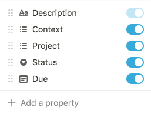
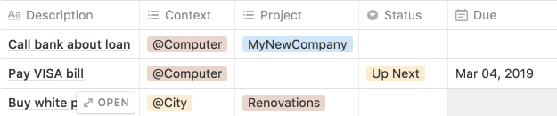
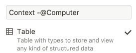
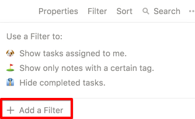
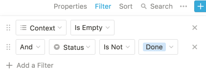
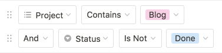
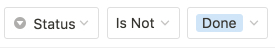

The aim of this post is to provide instructions for setting up a "Getting Things Done (GTD)"-style workflow using Notion. It does _not_ cover the workflow itself; it only covers how to setup the necessary views within Notion.

<!-- end -->

The target audience is people familiar with GTD that want to try a new tool for implementing it.

Some context:

* GTD is a methodology or framework for task organization, management, and execution. For details, refer to the excellent summary found [here](https://hamberg.no/gtd/).
* Notion bills itself as an "all-in-one workspace for your notes, tasks, wikis, and databases". It's available on web, desktop, and mobile. For details, refer to their website found [here](https://www.notion.so/).

## What You'll Get

Before you continue reading, let's go over the end result:

* View of all tasks
* An inbox of tasks not yet assigned to a context or given a status
* Task lists (or boards) filtered by:
	* Status - `Up Next`, `In Progress`, `Done`.
	* Context - `@Computer`, `@Home`, `#Someday` etc.
	* Project - `Renovations`, `Hawaii Trip`, etc.
* A calendar view of tasks

## Requirements

You'll need to create an account and log-in to [Notion](https://www.notion.so/).

## Steps

### Database Creation

1. Create a new page:
	1. Name it `Tasks`
	1. Select the `Database > Table` view
	
	

1. Modify the database properties by clicking `Properties`:
	
	
	
	1. Delete default properties
	1. Add the following properties:
		* Description - `Text` type
		* Context - `Multi-Select` type
		* Project - `Multi-Select` type
			* Use `Select` if you want tasks to only belong to a single project
		* Status - `Select` type
		* Due - `Date` type
	
	

1. In the table headers, click `Status` to show the drop-down menu. Then, click `Configure Options` to add default statuses
   * Add `Up Next`, `In Progress`, and `Done`
	
	

Now that the primary database is created, you can begin adding tasks into the master task list.
	

**Notes:**

* For `Context`, follow the [GTD framework](https://hamberg.no/gtd/#contexts) for populating the options. Use contexts such as `@home` or `@computer`.

### View Creation

Now, you can create additional views with specific filtering and sorting for inbox, contexts, projects, calendar, and more.

#### Inbox

To create an inbox view:

1. Click `Add a View` (in the top left)
1. Name it `Inbox`
1. Select `Table`:
	
	
	
1. Add a filter:
	
	
	
1. Filter only tasks without a context and that are not done:
	
	

#### Contexts

To create a view for a context (e.g. `@Computer`, `#Someday`):

1. Click `Add a View`
1. Name it `Context - <CONTEXT_NAME>`
1. Select `Table`
1. Add a filter for only tasks matching the context that are not done:
	
	

#### Projects

To create a view for a projects:

1. Click `Add a View`
1. Name it `Project - <PROJECT_NAME>`
1. Select `Table`
1. Add a filter for only tasks matching the project that are not done:
	
	

#### Calendar

To create a calendar view:

1. Click `Add a View`
1. Name it `Calendar`
1. Select `Calendar`
1. Add a filter for tasks that are not done:
	
	

#### Additional Views

To create additional views, follow the same pattern:

1. Add a new view of a certain type (try `Board` to for Kanban-style)
1. Add filters
1. Add sorting

**Examples:**

* Due Soon
	* Filter tasks that are not done
	* Sort by due date

## Conclusion

That's it! If you have any questions, feel free to e-mail me.

