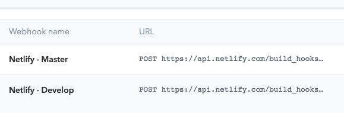

Learn how to setup a preview instance of your Gatsby site using the Contentful Preview API
and authenticate it using Netlify Identity with Google OAuth.

<!-- end -->

- [Introduction](#introduction)
- [Prerequisites](#prerequisites)
- [Setup](#setup)
  - [Gatsby](#gatsby)
  - [Netlify](#netlify)
  - [Contentful](#contentful)
- [Testing](#testing)
- [Conclusion](#conclusion)

## Introduction

Contentful provides a [Preview API](https://www.contentful.com/developers/docs/references/content-preview-api/) that returns unpublished content (e.g. draft blog posts) to allow users to preview this content on their website.

Setting up a server to host an instance of your Gatsby website that uses the Preview API and is accessible within a local/corporate network is relatively trivial. In my case, I am working with a remote content creator; we do not work on the same network nor do I have a dedicated local network available for VPN access. Gatsby provides [tutorials](https://www.gatsbyjs.org/docs/authentication-tutorial/) on authenticating routes but in this case I want the entire website to be authenticated without having to re-create page routes.

The solution I came up with is to run a preview instance on Netlify that uses [Netlify Identity](https://www.netlify.com/docs/identity/) for authentication and Netlify [Deploy Contexts](https://www.netlify.com/tags/deploy-contexts/) to ensure that the builds on a target branch use the Preview API and turn on authentication. [Contentful Webhooks](https://www.contentful.com/developers/docs/concepts/webhooks/) are used to trigger re-deploys on Netlify to ensure the preview website stays updated.


To summarize the changes:

* Wrap Gatsby's root element in a higher-order component that uses Netlify Identity to check if the user is logged in
  * If the user isn't logged in, redirect to a login screen
* Add support for environment variables to force builds to use the Contentful Preview API
* Create a deploy context on Netlify for the target branch (e.g. `develop` or `preview`) that sets environment variables
* Add a webhook to Contentful to trigger re-deploys for the target branch deploy context

## Prerequisites

This post will not cover how to set this up from scratch.

There are some prerequisites:

* [Gatsby](https://gatsbyjs.org) + [Contentful](https://contentful.com) project
  * I recommend using [the starter](https://github.com/contentful-userland/gatsby-contentful-starter)
* [Netlify](https://netlify.com) site linked to the project

There are plenty of good resources online ([1](https://www.contentful.com/r/knowledgebase/gatsbyjs-and-contentful-in-five-minutes/), [2](https://itnext.io/jamstack-basics-how-to-create-a-gatsby-starter-with-contentful-and-deploy-to-netlify-846354cc74bc)) you can use to learn how to set this up.

## Setup

### Gatsby

We can create a wrapper service for `netlify-identity-widget` that our application can use to check if the user is authenticated and allow the user to login.

First, install it as a dependency via `npm i -S netlify-identity-widget`.

`auth.js`:
```javascript
import netlifyIdentity from 'netlify-identity-widget';

// `window` won't be defined on SSR builds
if (typeof window !== 'undefined') {
  netlifyIdentity.init();
  window.netlifyIdentity = netlifyIdentity;
}

export default {
  isAuthenticated: false,
  authenticate(callback) {
    this.isAuthenticated = true;
    netlifyIdentity.open();
    netlifyIdentity.on('login', user => callback(user));
  },
  currentUser() {
    return netlifyIdentity.currentUser();
  },
};
```

Next, we create a higher-order component that we can use to wrap page components.

`withAuth.js`:
```javascript
import React, { PureComponent } from 'react';

import auth from './auth';

// We can check this before the component is rendered.
const alreadyLoggedIn = auth.isAuthenticated
|| auth.currentUser() !== null;

export default function withAuth(PageComponent) {
  return class WithAuthPageComponent extends PureComponent {
    state = {
      isLoggedIn: false,
      redirectPath: null,
    };

    componentDidMount() {
      // When it's first mounted, store the path name.
      // This allows us to redirect to it after the user has logged in.
      const path = window.location.pathname;
      this.setState({
        redirectPath: !alreadyLoggedIn && path !== '/'
          ? path
          : null,
      });
    }

    login = () => auth.authenticate((user) => {
      if (user) {
        this.setState({
          isLoggedIn: true,
        });
      }
    });

    render() {
      const {
        isLoggedIn,
        redirectPath,
      } = this.state;

      if (!isLoggedIn && !alreadyLoggedIn) {
        return (
          <button
            type="button"
            onClick={this.login}
            // This will center the button vertically
            // and horizontally. You don't need to do this necessarily.
            style={{
              left: '50%',
              top: '50%',
              transform: 'translate(-50%, -50%)',
            }}
          >
            LOGIN
          </button>
        );
      }

      if (redirectPath) {
        window.location.replace(redirectPath);
        return null;
      }

      return (
        <PageComponent {...this.props} />
      );
    }
  };
}
```

Now, we can create the function to do the wrapping (based on an environment variable -- we'll cover that after).

`wrapRootElementWithAuth.js`:
```javascript
import React from 'react';
import PropTypes from 'prop-types';

import withAuth from './withAuth';

const useAuth = process.env.ENABLE_NETLIFY_AUTH === 'true';

const wrapRootElement = ({
  element,
}) => {
  const RootElement = () => (
    <React.Fragment>
      {element}
    </React.Fragment>
  );

  if (!useAuth) {
    return <RootElement />;
  }

  const ElementWithAuth = withAuth(RootElement);
  return <ElementWithAuth />;
};

wrapRootElement.propTypes = {
  element: PropTypes.node.isRequired,
};

export default wrapRootElement;
```

Now, we need to do the element wrapping via Gatsby's [Browser APIs](https://www.gatsbyjs.org/docs/browser-apis/) and [Node APIs](https://www.gatsbyjs.org/docs/node-apis/). We can use `wrapRootElement` specifically.

`gatsby-browser.js`:
```javascript
import wrapRootElementWithAuth from './src/auth/wrapRootElementWithAuth';

export const wrapRootElement = wrapRootElementWithAuth;
```

`gatsby-node.js`:
```javascript
import wrapRootElementWithAuth from './src/auth/wrapRootElementWithAuth';

export const wrapRootElement = wrapRootElementWithAuth;
```

Now, we need to add support for `ENABLE_NETLIFY_AUTH`. Since we're using it on the client-side, we need to make it accessible to
modules. This can be accomplished with [`gatsby-plugin-env-variables`](https://www.gatsbyjs.org/packages/gatsby-plugin-env-variables/).

After installing it as a dependency (`npm i -S gatsby-plugin-env-variables`), add the following lines to your `gatsby-config.js` file:

```javascript
...
plugins: [{
  resolve: 'gatsby-plugin-env-variables',
  options: {
    // Variables in the whitelist will be available to builds as process.env.<NAME>, just
    // like Node processes
    whitelist: [
      'ENABLE_NETLIFY_AUTH',
    ],
  },
}],
...
```

Now, we must add environment variable support to switch to the Contentful Preview API.

Let's name this variable `CONTENTFUL_USE_PREVIEW`.

With `gatsby-source-contentful`, there is a `host` option we can use. I moved plugin options to their own module for encapsulation.

**NOTE: You will need both Preview and Delivery API tokens setup in your build environment.**

`contentful-options.js`:
```javascript
// We can use dotenv to read environment variables from a file (e.g. local environment).
// This is not required if you don't want to preview locally.
// This does require you to install it as a dependency:
//  `npm i -S dotenv`
require('dotenv').config({
  path: '.env',
});

const {
  CONTENTFUL_SPACE_ID: spaceId,
  CONTENTFUL_USE_PREVIEW,
} = process.env;
const usePreview = CONTENTFUL_USE_PREVIEW === 'true';

const host = usePreview
  ? 'preview.contentful.com'
  // If `null`, defaults to the Delivery API 
  : null;
const accessToken = usePreview
  // The Preview API uses a different token than the Delivery API
  ? process.env.CONTENTFUL_PREVIEW_TOKEN
  : process.env.CONTENTFUL_DELIVERY_TOKEN;

if (!spaceId || !accessToken) {
  throw new Error(
    'Contentful spaceId and access token need to be provided',
  );
}

module.exports = {
  spaceId,
  host,
  accessToken,
};
```

Then, pass them to the plugin as options:

`gatsby-config.js`:
```javascript
const contentfulOptions = require('./contentful-options');

...
plugins: [{
  resolve: 'gatsby-source-contentful',
  options: contentfulOptions
}],
...
```

### Netlify

Now, we need to setup Netlify to support authenticated builds using the Preview API.

1. Add the following environment variables:
   * `CONTENTFUL_PREVIEW_TOKEN` - Contentful API token
1. Add a deploy context (`Site settings > Build & deploy > Deploy Contexts`) for the target branch, e.g. `develop`
      
    

1. Update your build settings via `netlify.toml` to use authentication and the preview API

    `netlify.toml`:
      ```yaml
      # Settings for `develop` branch deploys.
      # If your target branch is named something else,
      # the context will be "context.<NAME>.environment".
      [context.develop.environment]
        CONTENTFUL_USE_PREVIEW = "true"
        ENABLE_NETLIFY_AUTH = "true"
      ```

1. Enable Identity, add Google as a provider, and **set it to invite-only**
1. Finally, add a build hook for the `develop` deploy context and copy it to your clipboard

    

### Contentful

Finally, we need to setup Contentful to trigger re-deploys of `develop` when content changes.

Open the Webhooks for your environment and add the copied build hook.
  


We can add linking from content to the preview website:

1. Open `Content Preview` for your environment
2. Select the content you want
3. Use the full Netlify URL for the preview URLs
    * e.g. `https://develop--projectname.netlify.com/blog/{entry.fields.slug}`

    

Then, a preview button will show up for creators on the right-side pane when creating content such as blog posts.


## Testing

To test the setup, push the changes to the `develop` branch after configuring Contentful and Netlify. Upon a successful deploy, you should be redirected to the login page when accessing the website.

## Conclusion

Questions? E-mail me.
